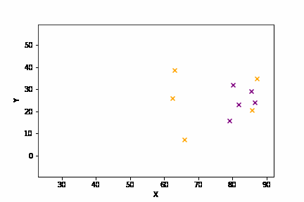
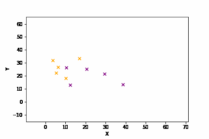

# Basketball Trajectory Prediction

Multi-agent trajectory prediction is a common problem seen in a variety of settings.
We focus on the game of basketball in which the players act as agents and the ball
moves according to actions taken by the players. We implement a transformer
encoder-decoder model to predict ball trajectory given an input sequence of player
and ball position data. We propose two experiments, physics ball 3D movement
prediction, and game-level ball 2D movement prediction. Our model is able to
capture 2D ball movement over 2 seconds reasonably well and some simple physics
ball movement over 0.6 seconds.

Results: [Colab Link](https://colab.research.google.com/drive/1PkiZAzO_9-pnYX6QtCdRXawosxBe1JWk?usp=sharing)

- Blue: Input Trajectory Sequence
- Red: Ground Truth Output Trajectory Sequence
- Green: Predicted Output Trajectory Sequence

#### Cross-Court Dribble

#### Ball Pass

